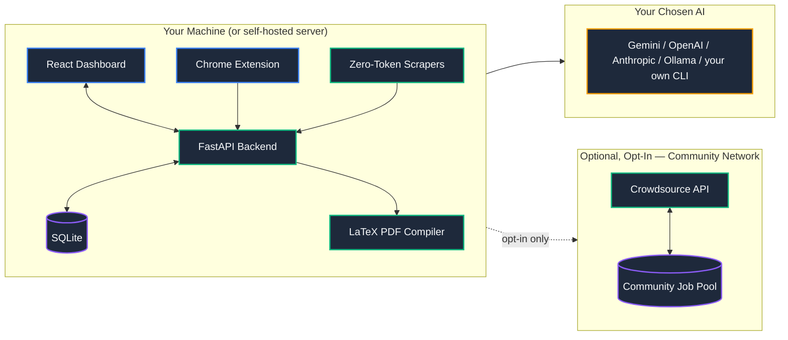

<p align="center">
  
</p>

<h1 align="center">CareerAgent</h1>

<p align="center">
  <strong>Automate the job hunt. Keep your privacy intact.</strong>
</p>

<p align="center">
  Open-source AI-powered job search. Runs locally via Docker. Evaluates every job against your resume, generates tailored LaTeX CVs, and tracks your pipeline — autonomously in the background.
</p>

<p align="center">
  <a href="https://careeragent.fyi"><strong>🌐 careeragent.fyi</strong></a>
  <br /><br />
  <a href="https://github.com/koteshrv/career-agent/stargazers"></a>
  <a href="https://github.com/koteshrv/career-agent/network/members"></a>
  <a href="https://opensource.org/licenses/MIT"></a>
  <a href="https://www.docker.com/"></a>
</p>

---

> **⚠️ Active Development (Beta):** APIs and database schemas may change between updates. Back up your `jobs.db` before pulling major updates.

---

## Why CareerAgent?

ATS was built to save recruiters' time. CareerAgent was built to save yours.

The average software engineer spends hours each week manually filtering job boards, copy-pasting descriptions, and reformatting resumes. CareerAgent replaces all of that with a local, autonomous agent that runs in the background — it finds jobs, scores them against your profile using a rubric-guided LLM, and prepares every application material right up to the submit button. You stay in control; the drudgery disappears.

**No vendor account. No subscriptions. No cloud. 100% free and open-source.**

---

## ✨ Features

| Feature | Description |
|---|---|
| 🔍 **Zero-Token Job Scrapers** | No browser automation for standard ATS platforms — Greenhouse, Lever, Ashby, Workday, SmartRecruiters, and 80+ others are read straight from their own public JSON APIs (the connectors are vendored from [career-ops](https://github.com/career-ops-hq/career-ops), see Acknowledgments). For sites with no public API and heavily protected ones like LinkedIn, the companion Chrome Extension saves jobs directly from the page you're browsing. |
| 🎯 **Agentic Deep Evaluation** | A massive LLM rubric grades each job against your resume across 5 dimensions: technical match, experience level, compensation, cultural signals, and red flags. Outputs a strict 0–100 score. |
| 📄 **Native LaTeX CVs** | 1-click injects missing keywords into your base resume and natively compiles a pristine ATS-friendly PDF. No cloud PDF service, no templates. |
| ✍️ **Drafts Open-Ended Answers** | Greenhouse, Ashby, and Lever forms ask "Why this role?". The agent reads the form, drafts paste-ready answers based on your CV, and leaves the final click to you. It never auto-submits. |
| 🌐 **Global Crowdsourced Job Network** | Opt-in to a shared, anonymous job pool powered by [career-agent-api](https://github.com/koteshrv/career-agent-api) — a standalone open-source serverless API. Your instance pushes scraped job postings to the network and pulls back jobs scraped by others. **Only public job listing data is ever exchanged. Your resume, profile, scores, and any personal information never leave your machine.** Deduplication is automatic. Community flagging removes fake and expired listings. |
| 🛡️ **Your Data, Your Machine** | All personal data — your resume, scores, notes, and application history — lives in a local SQLite database. No telemetry, no third-party data mining. The only external calls your instance makes are: (1) your chosen AI provider for job scoring, and (2) the crowdsource API if you choose to opt in. |
| 📊 **Application Pipeline** | Track every application across New, Applied, Interviewing, and Rejected stages. Full history log included. |
| 🤖 **Bring Your Own AI** | Works with Google Gemini (free tier available), OpenAI, Anthropic, fully locally via Ollama, or your own AI coding CLI (Claude Code, Codex, Gemini CLI, and others) if you already pay for one. You control the model. |

---

## 🚀 Getting Started

### Requirements
- **Docker** (Desktop or Engine) — that's it.
- A free [Google AI Studio](https://aistudio.google.com/) Gemini API key.

### Run in 60 seconds

```bash
# 1. Download the compose file
curl -O https://raw.githubusercontent.com/koteshrv/career-agent/main/docker-compose.yml

# 2. Start the app
docker compose up -d
```

Visit **[http://localhost:5173](http://localhost:5173)** — no vendor sign-up, no third-party OAuth. Set your own admin login on first visit and you're in; see the FAQ below ("Does it need an account or sign-in?") if you're running it for more than yourself.

Your jobs, resume, and settings are stored locally in a SQLite database via Docker volumes. Nothing leaves your machine except the Gemini API call for resume scoring.

> **AI Key:** On first launch, go to **Settings → Resume & AI** and paste your free Gemini API key. The app won't score jobs until you do.

---

### Chrome Extension (Optional — for LinkedIn & Naukri)

LinkedIn and similar platforms block server-side scraping entirely, no matter how it's done. The companion Chrome Extension bypasses this by extracting job data directly from the page you're browsing:

1. Open `chrome://extensions/` → Enable **Developer mode**
2. Click **Load unpacked** → Select the `chrome-extension/` folder from this repo
3. Pin the extension and use it on any job page to instantly save it to your pipeline

---

### Manual Setup (For Developers)

```bash
# Backend
python3 -m venv venv && source venv/bin/activate
pip install -r requirements.txt -r requirements-dev.txt

# Backend's zero-token scraper layer (backend/universal/) — a separate Node
# package, vendored from career-ops (see Acknowledgments)
cd backend/universal && npm install && cd ../..

# Frontend
cd frontend && npm install && cd ..

# Run everything
./scripts/run.sh
```

**Prerequisites:** Node.js 18+, Python 3.11+, `pdflatex` (TexLive/MiKTeX)

---

## 🏗 Architecture



---

## ❓ FAQ

**Does CareerAgent apply to jobs for me?**
No. It prepares every application right up to the click — resume, cover letter, open-ended answers. Then it hands the decision back to you. Mass auto-apply burns your ATS standing; CareerAgent removes the busywork but keeps the choice yours.

**How does job scoring work?**
A rubric-guided LLM evaluation across 5 dimensions (technical match, experience, compensation, culture, red flags) produces a 0–100 score. Anything below your configured threshold is auto-moved to Ignored so it doesn't clutter your New Matches.

**Is this really free?**
Yes, permanently. MIT-licensed. No paid tier, no waitlist, no vendor account. The only optional cost is an AI API key — and Google's Gemini free tier is more than enough for personal use.

**Where does my data go?**
Almost nowhere. All personal data — your resume, scores, notes, and application history — stays in a local SQLite file on your own disk. Your instance makes exactly two types of external calls:
1. **Your chosen AI provider** — Gemini by default (free tier), swappable for OpenAI, Anthropic, a local AI coding CLI you already have, or a fully local Ollama model for air-gapped operation — to score and tailor jobs against your resume.
2. **Crowdsource API** — *only if you opt in*. See below.

**What is the Global Crowdsourced Job Network?**
An optional, opt-in feature backed by [career-agent-api](https://github.com/koteshrv/career-agent-api) — a separate open-source serverless API anyone can self-host. When enabled, your CareerAgent instance pushes public job listing data (title, company, URL, description) to the shared network and pulls back listings scraped by other users. This dramatically expands the number of jobs you see without any extra scraping effort on your part.

**What is and isn't shared with the crowdsource network:**
- ✅ Shared: public job listing data (title, company, URL, description) — the same information publicly visible on job boards
- ❌ Never shared: your resume, your match scores, your application notes, your settings, or any information about you

**Does it need an account or sign-in?**
It's self-hosted, not a SaaS you sign up for — there's no CareerAgent account, no third-party service in the loop, and nothing about your install talks to us. The instance itself does have a lightweight login so it's safe to run for more than just you: the person who deploys it is the admin (local username/password, set at install), and anyone else signs in with their own Google or GitHub identity and waits for that admin to approve them — useful if you're running one instance for your household or a small team, unnecessary if it's just you. Running solo, you'll only ever see your own single login screen.

---

## 🤝 Contributing

Contributions are welcome! Check the open issues or open a PR. See [CONTRIBUTING.md](CONTRIBUTING.md) for guidelines.

## 📄 License

[MIT License](https://opensource.org/licenses/MIT) — free forever.

## 🙏 Acknowledgments

CareerAgent's zero-token ATS connectors (`backend/universal/providers/`) build directly on [career-ops](https://github.com/career-ops-hq/career-ops) (MIT), Santiago Fernández de Valderrama's open-source job-search CLI. Most of the modules that talk to Greenhouse, Lever, Ashby, Workday, and 80+ other job boards without a browser are vendored from career-ops with light adaptation for our multi-user backend; a few (for ATS platforms specific to the Indian market that career-ops's own catalog doesn't cover) are ours, built the same way and intended to be contributed back upstream. Its evaluation rubric and scoring philosophy also shaped how CareerAgent grades job fit. Huge thanks to the career-ops maintainers and community for building something this solid in the open.