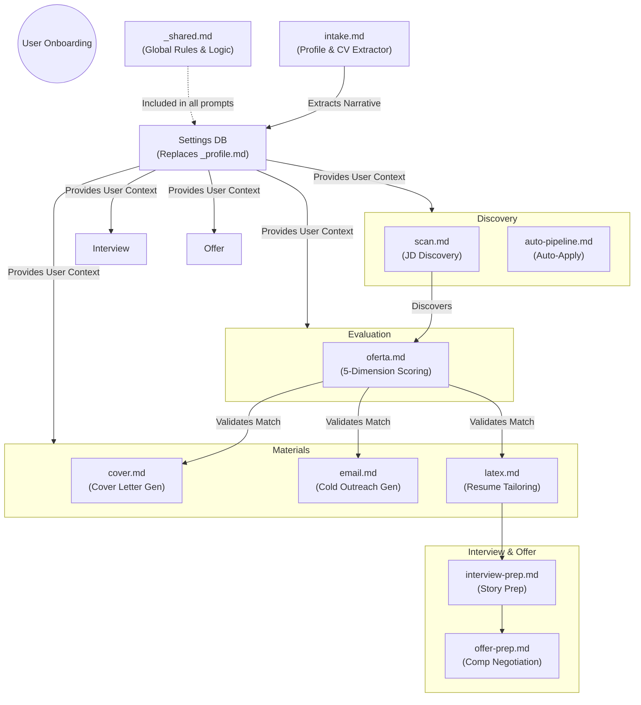

# Career-Agent Prompt Architecture (`modes/`)

This directory contains the AI prompt templates (modes) used by the `career-agent` backend. These prompts originated from `career-ops` but have been explicitly wrapped and transliterated for a stateless Web Application architecture.

## The Paradigm Shift

Unlike local CLI agents that run around the filesystem autonomously, `career-agent` is a stateless backend where Python securely orchestrates the data.
Therefore, all active prompt `.md` files in this directory are wrapped with a `[SYSTEM INSTRUCTION OVERRIDE]` header and an `[OUTPUT SCHEMA]` JSON footer.

1. **No Filesystem Commands:** The wrapper instructs the AI to ignore instructions like "read a folder" or "save to a file".
2. **Context Injection:** Python queries the Database (for the User Profile, Resume, and Job Data) and dynamically injects them into the prompt string before passing it to the LLM.
3. **Strict JSON Output:** The wrapper strictly enforces that the LLM must output a valid JSON object matching our FastAPI schemas.

## Mode catalog

| File | Mode | Purpose |
|---|---|---|
| `oferta.md` | `job` | Full A-G evaluation of a single offer (Wrapped for JSON) |
| `ofertas.md` | `jobs` | Multi-job comparison |
| `cover.md` | `cover` | Cover letter generator (Wrapped for JSON) |
| `email.md` | `email` | Application email drafts (Wrapped for JSON) |
| `interview-prep.md` | `interview-prep` | Company-specific interview intelligence (Wrapped for JSON) |
| `latex.md` | `latex` | LaTeX/Overleaf CV export (Wrapped for JSON) |
| `intake.md` | `intake` | Auto-Onboarding Profile Extractor (Wrapped for JSON) |
| `scan.md` | `scan` | Portal scanner (job discovery) |
| `apply.md` | `apply` | Live application assistant |

*(Note: Other legacy career-ops prompts are preserved here for reference and future integration).*

## Shared context and user customization

| File | Role |
|---|---|
| `_shared.md` | System context shared across modes: scoring system, global rules, source-of-truth boundary. |
| `_profile.template.md` | Seed for your narrative and negotiation scripts. (In career-agent, this data is extracted directly into the Settings Database). |

## Prompt Lifecycle & Connection

The following Mermaid diagram explains how the different prompt modes connect and cascade through the job search lifecycle:

