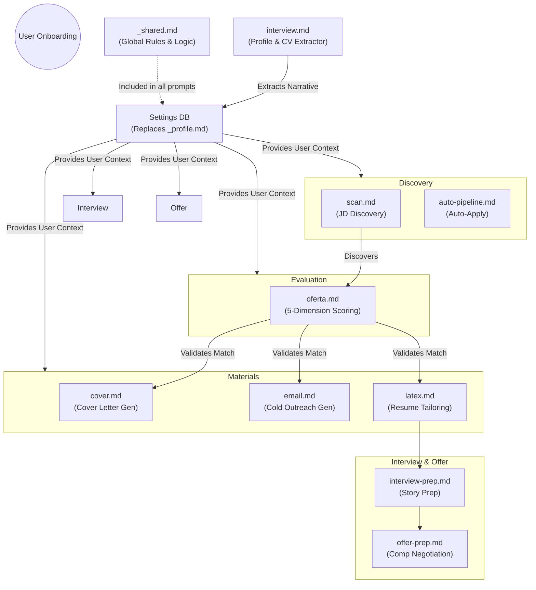

# Career-Agent Prompt Architecture

This directory contains the AI prompt templates (modes) used by the `career-agent` backend. These prompts originated from `career-ops` but have been explicitly transliterated for a stateless Web Application architecture.

## The Paradigm Shift

Unlike local CLI agents that run around the filesystem autonomously, `career-agent` is a stateless backend where Python securely orchestrates the data.
Therefore, all prompt `.md` files in this directory follow these structural rules:

1. **No Filesystem Commands:** The prompts do NOT instruct the AI to "read a folder" or "save to a file".
2. **Context Injection:** Python queries the Database (for the User Profile, Resume, and Job Data) and dynamically injects them into the prompt string before passing it to the LLM.
3. **Strict JSON Output:** The prompts strictly enforce that the LLM must output a valid JSON object matching our FastAPI schemas.

## Prompt Lifecycle & Connection

The following Mermaid diagram explains how the different prompt modes connect and cascade through the job search lifecycle:

